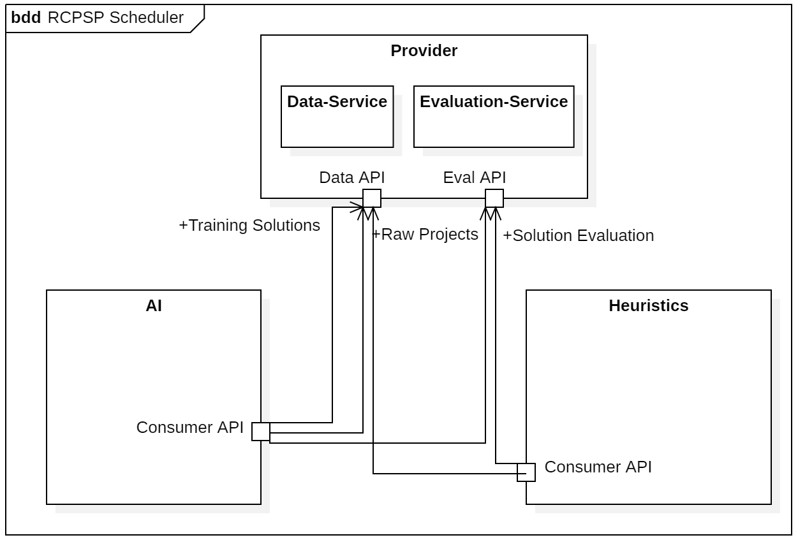
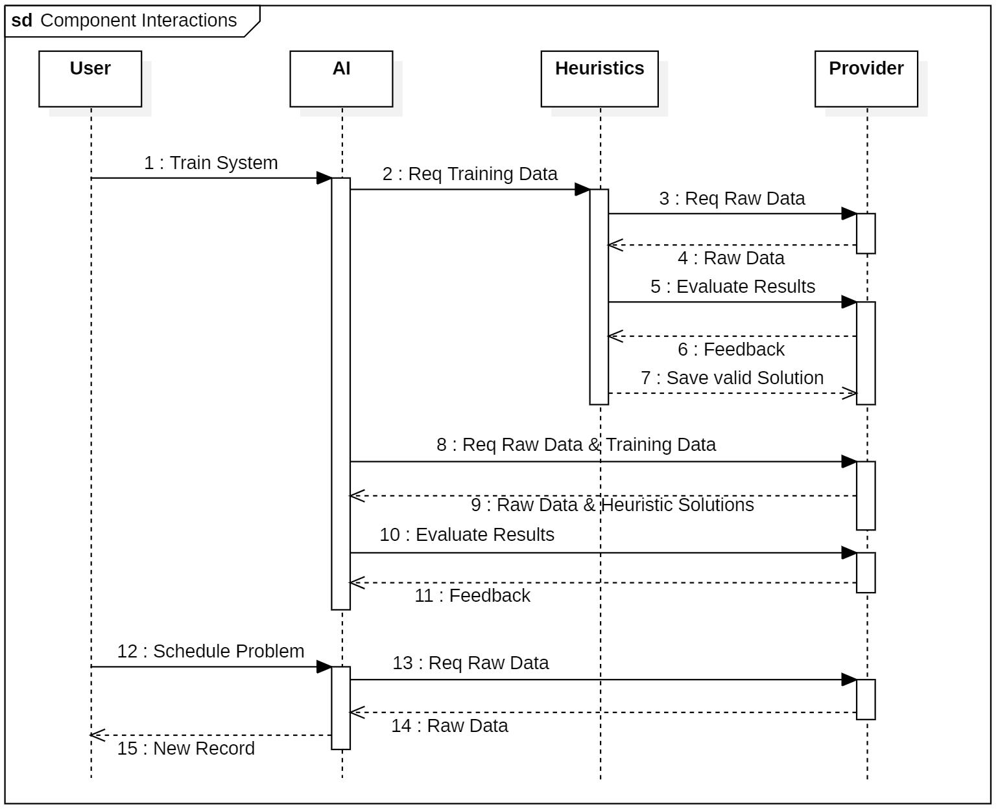
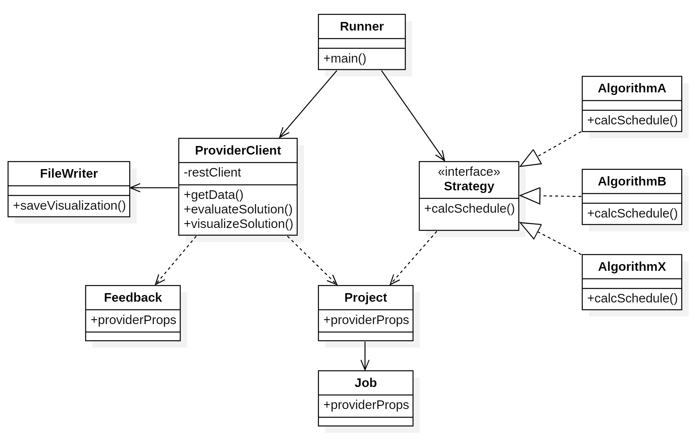

# RCPSP Scheduler

> Diagrams are created with [Star UML](https://staruml.io/download)

## Components v2

([Component Diagram v1](component-structure.png))

## Component Interactions v2

([Sequence Diagram v1](component-interactions.png))

## Scheduler Basic Classes

